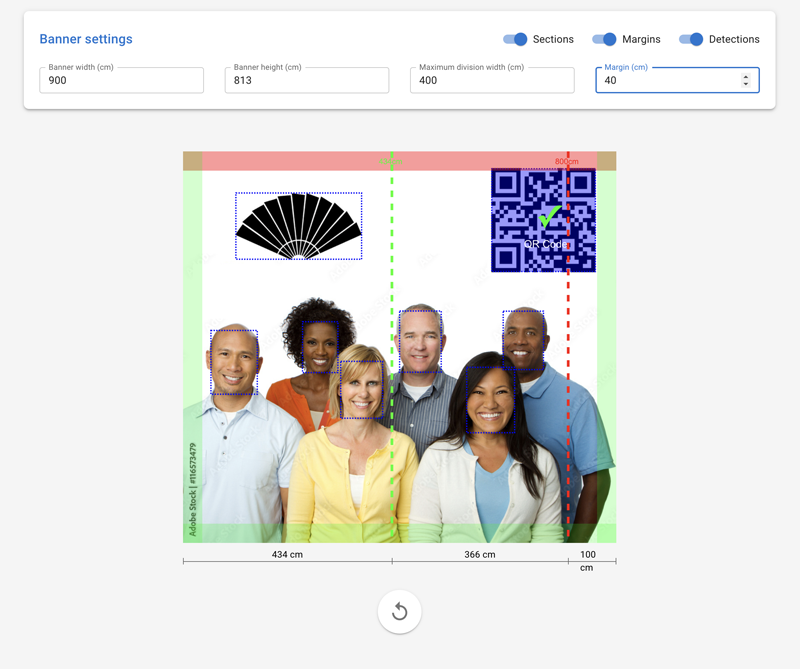

# Banner Layout Analyzer

<div align="center">
  
</div>

A comprehensive solution for analyzing advertising banner layouts, combining deep learning-based object detection with practical print preparation tools.

[Live Demo](https://frontend-production-683e.up.railway.app/)

> **Try it out**: Check the `examples/` directory for sample banner layout files that you can use to test the application. These files represent real-world printing banner layouts with various combinations of faces, logos, and QR codes.

## External Datasets Used

This project utilizes the following external datasets for training:

1. **WiderFace Dataset** - For face detection training
   - Source: [WiderFace Dataset](http://shuoyang1213.me/WIDERFACE/)
   - Description: A face detection benchmark dataset with faces in a wide range of scales, poses and occlusions.
   - Used for: Training the face detection component of our model

2. **Amazing Logos Dataset v4** - For logo detection training
   - Source: [Amazing Logos v4 on HuggingFace](https://huggingface.co/datasets/iamkaikai/amazing_logos_v4)
   - Description: A diverse collection of company logos and brand marks
   - Used for: Training the logo detection component of our model

The datasets were processed and combined using our custom pipeline to create a unified training dataset for banner layout analysis.

## Project Components

The project consists of three main components:

1. **Training Pipeline**
   - Custom dataset preparation combining faces, logos, and QR codes
   - YOLOv8-based model training with configurable parameters
   - Extensive metrics tracking and visualization using Weights & Biases
   - Support for different model sizes and training configurations

2. **Backend API**
   - Fast and efficient object detection service
   - Real-time banner analysis
   - QR code detection and URL validation
   - Scalable FastAPI-based architecture

3. **Frontend Application**
   - Interactive banner layout analysis
   - Visual tools for print preparation:
     - Division line placement with collision detection
     - Safety margin visualization
     - Real-time measurements in centimeters
   - Intuitive visualization of detected objects
   - Support for high-resolution banner images

The system is designed to assist in the preparation of large-format advertising banners by:
- Detecting and validating the placement of key elements (faces, logos, QR codes)
- Ensuring proper division of large banners for printing
- Maintaining safe margins for important content
- Providing real-time visual feedback on potential issues

## Project Structure

```
Banner-Layout-Analyzer/
├── data/                    # Dataset storage
│   ├── faces_dataset/       # Face detection dataset
│   ├── logos_dataset/       # Logo detection dataset
│   └── diverse_logos_dataset/ # Diverse logos dataset
├── src/                     # Source code
│   ├── data/               # Data handling modules
│   │   └── dataset_loader.py
│   ├── models/             # Model definition modules
│   │   └── detector.py     # LayoutDetector class
│   ├── utils/              # Utility modules
│   │   └── metrics.py      # Training metrics analysis
│   └── scripts/            # Executable scripts
│       ├── train.py        # Model training script
│       ├── prepare_datasets.py  # Dataset preparation
│       └── analyze_metrics.py   # Metrics analysis
├── tests/                  # Test files
└── requirements.txt        # Project dependencies
```

### Generated and Temporary Directories

During project operation, several directories are created automatically:

```
Banner-Layout-Analyzer/
├── runs/                   # YOLOv8 training results (managed by Ultralytics)
│   └── detect/            # Detection task results
│       └── {name}/        # Training run results
│           ├── weights/   # Model weights
│           ├── results.csv # Training metrics
│           └── plots/     # Training visualizations
│
├── data/                  # Generated datasets
│   ├── faces_dataset/     # Created by prepare_datasets.py
│   ├── logos_dataset/     # Created by prepare_datasets.py
│   └── diverse_logos_dataset/ # Created by prepare_datasets.py
│
├── wandb/                 # Weights & Biases logs
│   └── run-{date}/       # Individual W&B run data
│
├── analysis/             # Training analysis results
│   ├── metrics_report_{timestamp}.txt
│   └── metrics_analysis_{timestamp}.png
│
├── test_results/         # Model testing results
│   └── detection_{name}.png
│
└── banner_layout_analyzer.egg-info/  # Python package metadata
    └── (created during development installation)
```

**Note**: These directories are automatically managed and should not be modified manually. They are also included in `.gitignore` and should not be committed to version control.

- `runs/`: Standard YOLOv8 output directory, managed by Ultralytics
- `data/`: Contains prepared datasets, regenerated using prepare_datasets.py
- `wandb/`: Created when using Weights & Biases logging (--wandb flag)
- `analysis/`: Contains training analysis reports and visualizations
- `test_results/`: Stores model detection test results
- `banner_layout_analyzer.egg-info/`: Created during `pip install -e .`

## Installation

1. Clone the repository:
```bash
git clone https://github.com/yourusername/Banner-Layout-Analyzer.git
cd Banner-Layout-Analyzer
```

2. Install required packages:
```bash
pip install -r requirements.txt
```

3. For development mode (if you want to modify the source code):
```bash
pip install -e .
```

## Dataset Preparation

### 1. Individual Datasets

The system uses three types of datasets that need to be prepared separately:

#### Faces Dataset
```bash
python src/scripts/prepare_datasets.py --dataset faces --image-size 640 --num_samples 20000
```

#### Logos Dataset
```bash
python src/scripts/prepare_datasets.py --dataset logos --image-size 640 --num_samples 20000
```

#### Diverse Logos Dataset
```bash
python src/scripts/prepare_datasets.py --dataset diverse_logos --image-size 640 --num_samples 20000
```

Arguments for prepare_datasets.py:
- `--dataset`: Type of dataset to prepare ['faces', 'logos', 'diverse_logos', 'combined']
- `--image-size`: Size to resize images to (default: 640)
- `--num_samples`: Number of samples to generate (default: 1000)
- `--output_dir`: Base output directory (default: 'data')
- `--quick-test`: Use quick test settings (32x32 images, 100 samples)
- `--clear-cache`: Clear HuggingFace datasets cache

### 2. Combined Dataset

After preparing individual datasets, you can create a combined dataset for training:

```bash
python src/scripts/prepare_datasets.py --dataset combined --image-size 640
```

This will:
1. Check for the existence of all required datasets
2. Create a combined dataset with proper class mappings
3. Generate a configuration file at `data/combined_dataset.yaml`

### Dataset Storage Structure

Each dataset is stored in the following structure:
```
data/
├── faces_dataset/
│   ├── train/
│   │   ├── images/
│   │   └── labels/
│   └── valid/
│       ├── images/
│       └── labels/
├── logos_dataset/
└── diverse_logos_dataset/
```

The labels are stored in YOLO format (normalized coordinates):
```
<class_id> <x_center> <y_center> <width> <height>
```
Where:
- `class_id`: Integer representing the class (0 for faces, 1 for logos)
- `x_center`, `y_center`: Normalized center coordinates (0-1) relative to image width and height
- `width`, `height`: Normalized width and height (0-1) relative to image dimensions

Example label file content:
```
0 0.716797 0.395833 0.216406 0.147222  # Face
1 0.287109 0.322917 0.148438 0.145833  # Logo
```

## Training

### Training Modes

The system supports three training approaches:

1. Single Dataset Training:
```bash
# Train on faces only
python src/scripts/train.py --dataset faces --epochs 100 --imgsz 640 --batch 16 --name "face_detector" --model yolov8n.pt

# Train on logos only
python src/scripts/train.py --dataset logos --epochs 100 --imgsz 640 --batch 16 --name "logo_detector" --model yolov8n.pt

# Train on diverse logos
python src/scripts/train.py --dataset diverse_logos --epochs 100 --imgsz 640 --batch 16 --name "diverse_logos_detector" --model yolov8n.pt
```

2. Combined Dataset Training:
```bash
python src/scripts/train.py --dataset combined --epochs 10 --imgsz 640 --batch 8 --name "combined_detector_s" --model yolov8n.pt
```

Arguments for train.py:
- `--dataset`: Dataset choice ['faces', 'logos', 'diverse_logos', 'combined']
- `--epochs`: Number of training epochs (default: 100)
- `--imgsz`: Input image size (default: 640)
- `--batch`: Batch size (default: 16)
- `--name`: Name for this training run
- `--model`: YOLO model type ['yolov8n.pt', 'yolov8s.pt', 'yolov8m.pt', 'yolov8l.pt', 'yolov8x.pt']
- `--fraction`: Fraction of dataset to use (0.0-1.0)
- `--resume`: Resume training from last checkpoint
- `--wandb`: Enable Weights & Biases logging

### Training Output

Training results are saved in `runs/detect/{name}/`:
```
runs/detect/{name}/
├── weights/
│   ├── best.pt        # Best weights
│   └── last.pt        # Latest weights
├── results.csv        # Training metrics
└── plots/            # Training plots
```

### Manual Metrics Sending

If training was interrupted, you can manually send metrics to Weights & Biases using:
```bash
python src/scripts/train.py --name your_training_name --wandb --send-metrics
```

This will:
1. Load metrics from `results.csv`
2. Send all epoch metrics to W&B in chronological order
3. Add final metrics to the run summary
4. Upload training plots and validation predictions

Note: Use the same training name as in the interrupted training session.

## Testing and Evaluation

### 1. Verify Dataset Labels

To verify dataset annotations:
```bash
python src/scripts/verify_labels.py --dataset data/diverse_logos_dataset --samples 5
```

Arguments:
- `--dataset`: Path to dataset directory
- `--samples`: Number of random samples to verify (default: 5)

### 2. Test Model Detection

To test the trained model on images:
```bash
python src/scripts/test_model.py --model runs/detect/combined_detector/weights/best.pt --images data/test_img/image.jpg --output test_results
```

Arguments:
- `--model`: Path to model weights
- `--images`: Paths to test images (can specify multiple)
- `--output`: Output directory for visualizations (default: 'test_results')

### 3. Test QR Code Detection

To test QR code detection separately:
```bash
python src/scripts/test_qr.py --image path/to/image.jpg --output test_results_interim
```

Arguments:
- `--image`: Path to the image file containing QR code(s)
- `--output`: Output directory for results (default: 'test_results')

The script will:
1. Detect QR codes in the image using OpenCV
2. Display decoded data and bounding box coordinates
3. Save detection results to a JSON file
4. Create a visualization with:
   - Blue rectangles for bounding boxes
   - Red lines showing exact QR code corners
   - Text labels with decoded QR code data
5. Save the visualization as PNG file

Example output structure:
```
test_results/
├── qr_detection_image1.json    # Detection data in JSON format
└── qr_detection_image1.png     # Visualization with detected QR codes
```

### 4. Analyze Training Metrics

To analyze training results:
```bash
python src/scripts/analyze_metrics.py --model_dir runs/detect/combined_detector --output_dir analysis
```

Arguments:
- `--model_dir`: Directory containing model training results
- `--output_dir`: Directory to save analysis results (default: 'analysis')

### API Configuration

The API server can be configured using command line arguments:

- `--host`: Host to run the API on (default: "0.0.0.0")
- `--port`: Port to run the API on (default: 8000)
- `--reload`: Enable auto-reload for development

Example:
```bash
python src/scripts/run_api.py --host localhost --port 8000 --reload
```

### Frontend Application

The project includes a React-based frontend for easy interaction with the API.

#### Running the Frontend

1. Navigate to the frontend directory:
```bash
cd frontend
```

2. Install dependencies:
```bash
npm install
```

3. Start the development server:
```bash
npm run dev
```